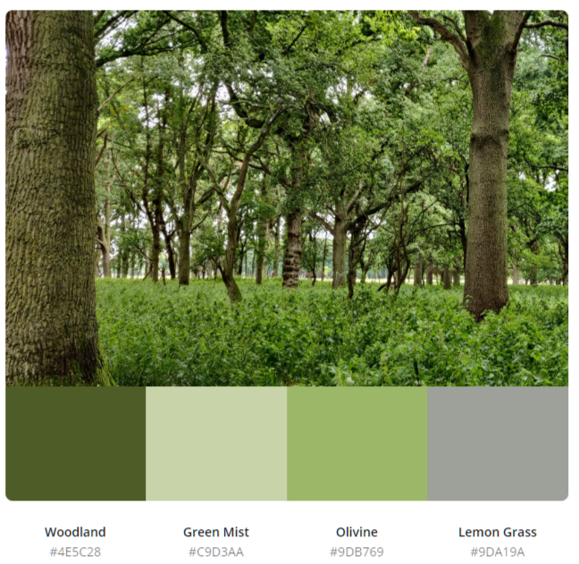

# Shinrin-Yoku

This is a promotional website for a forest bathing meetup group , one of it's strategies is promote the importance of trees and nature. 

Forest bathing originated in Japan in the 1980s , where it's known as *Shinrin-Yoku*. It's the practice of walking in any natural environment and consciously connecting with what’s around you

This site will hopefully create a community of people who appreciate trees and nature , and maybe wish to learn more about protecting them in their local city. 

---

## Table of contents
1. [**UX**](#ux)

2. [**Features**](#features)

3. [**Technologies Used**](#technologies-used)

4. [**Testing**](#testing)

5. [**Deployment**](#deployment)

6. [**Credits**](#credits)

---

## UX

### Scope

This is a fictional meetup group , so this is no limitations on the content . The site will be made to an MVP first , and if there is additional time, content/features will can be added.

**User stories**

1. As a visitor to the site, I want to read about forest bathing and it's benefits, so that I can decide if I wish to take part.
2. As a visitor to the site, I want to register my details , so I can be added to an email list to receive updates.
3. As a visitor to the site, I want to view nice pictures of nature.
4. As a visitor to the site, I want to read about locations of future forest bathing events.
5. As the site owner , I want to promote my service and have participants for meetups.
6. As the site owner , I want to promote the benefits of Trees and nature in our environment. 

### Structure

Site will be put together using HTML, the Bootstrap framework and CSS.

Site will be one page with minimum of three sections , suitable for visits from mobile phones.

### Skeleton

**Wireframe**

Below is the initial wireframe.

Mobile use a first approach - one page site , navigation menu at the top. 

Section 1 - Home page - Navbar at top . Hero image below. With brief headline paragraph.

Section 2 - About page - Introduction paragraph followed by various panels of either Text or images promoting forest bathing , in a gallery format.

Section 3 - Contact page - Email subscribe form , contact information and links to various social media channels in footer section.

### Surface

**Colours**

Various shades of green or natural colours, colours of site will be referenced to [image colours](https://photos.app.goo.gl/seXCA8SYe9CFaBF1A) by using a colour picker. 

Root variable are used so colours can be updated quickly if revisions are needed. Below are the current set of rgba colours which are very much like to change soon.

     --green-bg-light: 135, 170, 75; /* light green background colour */
     --green-hg-dark: 80, 100, 45; /* Dark Green colour for heading */
     --green-mossy: 125, 188, 143; /* mossy green colour */
     --white-text : 255, 255, 255; /* white colour used for hero text and mid section*/
     --whitesmoke : 245, 245, 245; /* off white colour used in the footer for the social media icons */
     --black-shadow : 17, 17, 17; /* black colour used for the hover shadow for icon links in footer section */

**Icons** used are from fontawesome.com .

**Images** used are one I took myself. 

**Fonts** :  Header (h1 and h2) text elements use the font:  **"Shadows Into Light"**.

​				All other text uses the font:  **"Montserrat"**. 
​
##### back to [contents](#table-of-contents)

---

## Features

The site is laid out on one page that has several sections .

### Existing Features

- It is responsive to screen size thanks to bootstrap.

- The navbar at the top collapses into a hamburger button on smaller screens.

- One of the image cards in the gallery is hidden on small screens to improve flow of the page.

- It has a subscription form ( this is for display purposes only , it's not working at the moment as it's out of scope for this phase of the project).

- Form validation on subscribe form , alert if name or email is empty. 

- In each section a button will prompt / take the user to another section. 
  

### Features Left to Implement ( or out of scope)

- In the footer section , the icons will incorporate some sort of hover animation

- The navbar button will float on the top of the screen .

- Improvements for visually impaired such as more descriptive tags and better contrasting colours (as per lighthouse report)

- The images of trees can be clicked on and the user will be brought to [another site](https://www.curio-eco.com/world/tagged-trees/2538832?lat=53.34427142201096&lng=-6.316257453758462&zml=18) that pinpoints the exact location of the tree. 

- Have the subscription form add the visitor to an email list.

 ##### back to [contents](#table-of-contents)

---
## Technologies Used

- Languages : HTML , CSS and Bootstrap framework (Navbar uses Javascript).

- IDE: [Gitpod](https://www.gitpod.io/) (very similar to Visual Studio code but online).

- Version control: Git on [Gitpod](https://www.gitpod.io/) and [Github](https://github.com/).

- Wireframe: [Balsamiq](https://balsamiq.com/)

- Browser Developer tools : [Firefox Developer Edition](https://www.mozilla.org/en-US/firefox/developer/) (really helped with fonts and images) and [Google Chrome](https://www.google.com/chrome).

- KanBan planner : [Github projects](https://github.com/kenwals/shinrin-yoku/projects/1) . 

- Markdown editor: [Typora](https://typora.io/) was used when doing bulk updates to my README.md file, Gitpod editor was used for minor updates.

- Image editing: [Adobe online resize tool](https://www.adobe.com/ie/photoshop/online/resize-image.html) and [tinypng](https://tinypng.com/) compression tool.

- Fonts : [Google Fonts](https://fonts.google.com/)

- Icons : [Fontawesome](https://fontawesome.com/)

- Colours palette : [Canva](https://www.canva.com/colors/color-palette-generator/)

- Planning: MS Excel was used for filename changes planning and making the names lowercase.

##### back to [contents](#table-of-contents)  

---
## Testing

In this section, you need to convince the assessor that you have conducted enough testing to legitimately believe that the site works well. Essentially, in this part you will want to go over all of your user stories from the UX section and ensure that they all work as intended, with the project providing an easy and straightforward way for the users to achieve their goals.

Whenever it is feasible, prefer to automate your tests, and if you've done so, provide a brief explanation of your approach, link to the test file(s) and explain how to run them.

For any scenarios that have not been automated, test the user stories manually and provide as much detail as is relevant. A particularly useful form for describing your testing process is via scenarios, such as:

Test being used will be:

- [web.dev](https://web.dev/measure/) (lighthouse)

- http://ami.responsivedesign.is/

- Peer review on slack

- Devices on Developer tools in Chrome and Firefox DE

Devices manually tested browser for the following devices on:  

- Android Mobile phone (Screen width 360px) 
- Android Mobile phone (Screen width 412px)
- Android Tablet (Screen width 600px) sm
- Smart TV (Screen width 1920px) lg
- Windows laptop (Screen width 2560px) 

1. Contact form:
    1. Go to the "Contact Us" page
    2. Try to submit the empty form and verify that an error message about the required fields appears
    3. Try to submit the form with an invalid email address and verify that a relevant error message appears
    4. Try to submit the form with all inputs valid and verify that a success message appears.

In addition, you should mention in this section how your project looks and works on different browsers and screen sizes.

You should also mention in this section any interesting bugs or problems you discovered during your testing, even if you haven't addressed them yet.

### Bugs encountered on the way

1. Navbar was not expanding collapsing correctly. its turns out i choose the wrong emmet shortcut when starting the site. So the incorrect version of bootstrap and javascript was choosen. once i replaced both the navbar worked correctly.
3. Git commit issue , in the beginning i was using only git on the command line . Somehow not all my commits were appearing in Github when i pushed them . the problem maybe linked to me using gitpod in more then one browser (chrome and firefox) while i was trying to debug something else. I resolved this issue by git commiting with the Gitpod UI instead.
4. Page title was too long for mobile phone viewing , it was causing the hamburger button onto a new line. Fix was made by adding a media query to allow the h1 title font size reduced for smaller screens.
4. CSS comments , i made a mistake with the format used initially for commenting in the CSS file. I was using the javascript format (//)for commenting, this resulted in a problem with the colours not displaying correctly for a while in the infant version of the site.
5. text shadow typo mistake
6. images missing on github pages
7. unable to customize the ul for locations

### Known issues

1. It was desirable to have the navbar menu button float at the top of the screen , but i had difficulty getting the menu to collapse itself automatically with Bootstrap or CSS. I believe it's dependant on Javascript code, and Javascript is out of scope for this project.
2. When tested on my smart tv browser, the background colours don't show for hero text , mid section text and footer section. 
3.

### Project barriers and solutions

### Version control

### Functionality Testing

### CSS3 validator 

### HTML5 validator

### Usability Testing

### Compatibility Testing

### Performance Testing

### Testing User Stories

##### back to [contents](#table-of-contents)

---
## Deployment

For easy deployment you will need a Github user account and a Gitpod user account. If you wish to make changes to this repository , please follow the Github steps first. 

**Github**

Github is a code hosting platform for version control and collaboration. It's free to enroll for a user account and i would recommend you have one if you wish to deploy this repository and make changes.

When you have a Github account you can simple click on the Fork button on the top right corner. This is clone the Shinrin-Yuko repository for your Github account, then you can make any changes you like.

**Gitpod**

The site can deployed easily on a gitpod online workspace, you first register a free user account on http://gitpod.io/, then download the gitpod extension on your preferred internet browser. On signing up you will be expected to  have a Github user account.

Once you have the extension on your browser , a green gitpod button will appear beside this repository in github. for best results fork the repository in your personal account before you open it in 

Differences between the deployed version and the development version:
- none!

##### back to [contents](#table-of-contents)  

---
## Credits

### Content

- [Nature therapy ireland](https://www.instagram.com/naturetherapyireland) 
- [Shinrin Yuko Finland]( https://www.shinrin-yoku.fi/home-en)
- [Forest Therapy Society, Japan](https://fo-society.jp/therapy/cn45/e_en.html)
- [Dublin City Council Tree strategy](https://www.dublincity.ie/sites/default/files/media/file-uploads/2018-08/Dublin_City_Tree_Strategy_2016-2020.pdf)

### Resources

- [Bootstrap components](https://getbootstrap.com/)
- [W3schools](https://www.w3schools.com/)
- [css tricks](https://css-tricks.com/) 
- [YouTube](https://www.youtube.com/)

### Media

- The photos used in this site were taken by me mostly in Dublin, Ireland.

### Acknowledgements

- [This newspaper article from The Irish Times](https://www.irishtimes.com/news/environment/busconnects-final-plans-for-16-dublin-bus-corridors-published-1.4400026 "Irish Times newspaper"). On the back this news article, I was inspired to make a site that could promote the importance of Trees and why they should be cherished and valued more then wider roads in our cities.

- The book ["The Hidden Life of Trees"](https://www.goodreads.com/book/show/28256439-the-hidden-life-of-trees) by Peter Wohlleben .

- Various people at [code institute](https://codeinstitute.net/)

- [Imbibe](https://imbibe.ie/) Coffee Roasters and [Barry's Tea](https://www.barrystea.ie/)

  
