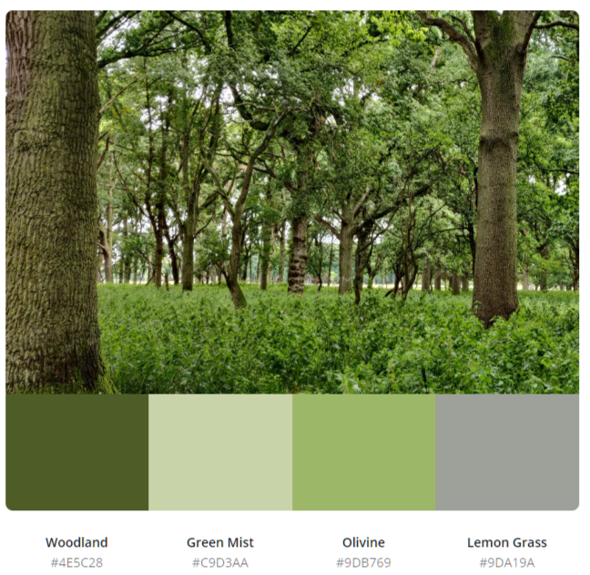

# Shinrin-Yoku

This is a [promotional website](https://kenwals.github.io/shinrin-yoku/) for a forest bathing meetup group, one of its strategies is to promote the importance of trees and nature. 

Forest bathing originated in Japan in the 1980s, where it is known as *Shinrin-Yoku*. It is the practice of walking in any natural environment and consciously connecting with what’s around you.

This [site](https://kenwals.github.io/shinrin-yoku/) will hopefully create a community of people who appreciate trees and nature, and maybe wish to learn more about protecting them in their local city. 

---

## Table of contents

1. [**UX**](#ux)
    - [**Scope**](#scope)
    - [**Structure**](#structure)
    - [**Skeleton**](#skeleton)
    - [**Surface**](#surface)
    
2. [**Features**](#features)
    - [**Existing features**](#existing-features)
    - [**Features left to implement**](#features-left-to-implement)

3. [**Technologies Used**](#technologies-used)

4. [**Testing**](#testing)
    - [**Testing documentation can be found here in a seperate file**](TESTING.md)

5. [**Deployment**](#deployment)

6. [**Credits**](#credits)
    - [**Content**](#content)
    - [**Resources**](#resources)
    - [**Media**](#media)
    - [**Acknowledgements**](#acknowledgements)

---

## UX

### Scope

This is a fictional meetup group, so there are no limitations on the content. The site will be made to an MVP first, and if there is additional time, content/features can be added.

#### User stories

##### Visitor goals

1. As a visitor to the site, I want to read about forest bathing and its benefits, so that I can decide if I wish to take part.
2. As a visitor to the site, I want to register my details, so I can be added to an email list to receive updates.
3. As a visitor to the site, I want to view nice pictures of nature.
4. As a visitor to the site, I want to read about locations of future forest bathing events.

##### Owner goals

5. As the site owner, I want to promote my service and have participants for meetups.
6. As the site owner, I want to promote the benefits of Trees and nature in our environment. 

### Structure

Site is put together using HTML, the Bootstrap framework and CSS.

A Mobile first approach is taken - site is all on one page with three sections, navigation menu at the top. 

Navigation between sections can be done via the navbar or by "call to action" buttons.

### Skeleton

Section 1 - Home page - Navbar at top. Hero image below. With brief headline paragraph. Under that a mid-section with an introduction paragraph.

Section 2 - About page -  Here is displayed various panels of either Text or images promoting forest bathing, in a gallery format.

Section 3 - Contact page - Email subscribe form, contact information and links to various social media channels in footer section.

**Wireframe**

Below is the initial wireframe.

### Surface

**Colours**

The site theme is about connecting with nature, so the colours too are connected to nature. Various shades of green or natural colours are used. Point of reference for the colours chosen are taken from the site images using a colour palette tool. 

Root variables are used so colours can be updated quickly if revisions are needed. 

Colours used are:

- "Woodland" Green  (#4e5c28) : Used for headings and text when on light background. This colour is also used as background on footer. 
- "Green Mist"  (#c9d3aa) : Used on the background of the body and navbar.
- "Nador" Green  (#4F5C54) :  Used on the background of the mid section between hero image and about section.
- "Lemon Grass"  (#9da19a) : Used for text shadow on the hero image text, and box shadow on cards.
- White  (#FFFFFF) : used for text when on a dark background.
- WhiteSmoke  (#F5F5F5) : used for the footer icons.

As colours are configured using rbga() properties, these can be tweaked with opacity values to give more variety to the palette while keeping the uniformity. 

**Icons** used are from fontawesome.com. These icons are visible on buttons, the sub heading of each card in the card gallery and as the social media icons in the footer.

**Images** used are ones I took myself. The original high quality images are located [here](https://photos.google.com/share/AF1QipNpAlgEAwPS5Pjltq_81afFH2kgaHUYhmgoE-poGQhNGkx4mknGbwwCHOTYylgYRw?key=bEFOWWloNGJ6REdpbEZDRzVjd3BROWREaEprTXF3). Images are in jpg format and have been compressed. 

**Fonts** : 

- **"Shadows Into Light"** was used for Header (h1,h2 and h3) text elements
- **"Montserrat"** was used for all other text. 

On slow connections, another font may be visible while the site is loading.

##### back to [contents](#table-of-contents)

---

## Features

The site is laid out on one page that has several sections.

### Existing Features

- It is responsive to screen size thanks to bootstrap.

- The navbar remains fixed to the top of the screen, and collapses into a hamburger button on smaller screens.

- One of the image cards (title: improving air quality) in the gallery is hidden on small screens to improve flow of the page.

- There is form validation on subscription form, an alert displays if name or email fields are empty. 

- In the first two sections a call to action button prompts the user to another section. 

- Hover animations are used on the cards (box shadow appears) in the about section and the social media icons (grow in size) in the footer section.

- Contrasting colours and aria labels are used to ensure site supports visually impaired visitors. 

- Some images of trees can be clicked on and the user will be brought to [another site](https://www.curio-eco.com/world/tagged-trees/2538832?lat=53.34427142201096&lng=-6.316257453758462&zml=18) that pinpoints the exact location of the tree.
  
### Features Left to Implement

- Have the subscription form add the visitor details to an email list database. 

 ##### back to [contents](#table-of-contents)

---
## Technologies Used

- Languages : HTML, CSS and Bootstrap framework (Navbar uses JavaScript).

- IDE: [Gitpod](https://www.gitpod.io/) (runs Visual Studio code online).

- Version control: Git on [Gitpod](https://www.gitpod.io/) and [Github](https://github.com/).

- Wireframe: [Balsamiq](https://balsamiq.com/)

- Browser Developer tools : [Google Chrome](https://www.google.com/chrome) and [Firefox Developer Edition](https://www.mozilla.org/en-US/firefox/developer/) (which really helped with fonts, accessibility and images).

- Kanban planner : [Github projects](https://github.com/kenwals/shinrin-yoku/projects/1). 

- Markdown editor: [Typora](https://typora.io/) was used when doing spellchecks and big changes to my README.md file, Gitpod editor was used for minor updates.

- Image editing: [Adobe online resize tool](https://www.adobe.com/ie/photoshop/online/resize-image.html) and [tinypng](https://tinypng.com/) compression tool.

- Fonts : [Google Fonts](https://fonts.google.com/)

- Icons : [Fontawesome](https://fontawesome.com/)

- Colours palette : [Canva](https://www.canva.com/colors/color-palette-generator/) was used for automatically selecting green colours from images.

- Colour tool : [Google Material Design Color Tool](https://material.io/resources/color/#!/?view.left=0&view.right=1&secondary.color=9db769&primary.color=4e5c28&secondary.text.color=000000&primary.text.color=ffffff) was used when trying to decide what colour to use against which background.

- File renaming utility : PowerRename from [PowerToys on Windows 10](https://www.windowscentral.com/how-bulk-rename-your-files-windows-10-powertoys)

- Pomodoro timer : [Tomato Clock](https://chrome.google.com/webstore/detail/tomato-clock/enemipdanmallpjakiehedcgjmibjihj) 

- Overflow rescue tool : [Unicorn Revealer](https://chrome.google.com/webstore/detail/unicorn-revealer/lmlkphhdlngaicolpmaakfmhplagoaln) was used for when a scroll left to right appeared on my site on smaller screens.

- HEX to RGB converter : [RapidTables](https://www.rapidtables.com/convert/color/hex-to-rgb.html) and [webfx](https://www.webfx.com/web-design/hex-to-rgb/)

- Colour contrast checking for Accessibility refinements : [WebAIM](https://webaim.org/resources/contrastchecker/) was used for when trying to decide what colours to use for text against which background colour.

- Favicon creator : [favicon.io](https://favicon.io/favicon-generator/)

- Autoprefixer CSS : [Autoprefixer](https://autoprefixer.github.io/)

- Auto formatter for HTML and CSS : [dirtyMarkUp](https://www.10bestdesign.com/dirtymarkup/) and  [webformatter](https://webformatter.com/html)

- Image conversion tool to WEBP (Next gen image format) : [XnConvert](https://www.xnview.com/en/xnconvert/)

##### back to [contents](#table-of-contents)  

---
## Testing

Testing documentation can be found [here in a seperate file](TESTING.md) . 

##### back to [contents](#table-of-contents)

---
## Deployment

For easy deployment on GitHub pages you will need a GitHub user account and a possibly a Gitpod user account. If you wish to make changes to this repository, please follow the GitHub steps first. 

**GitHub**

GitHub is a code hosting platform for version control and collaboration. It's free to enrol for a user account and I would recommend you have one if you wish to deploy this repository and make changes.

When you have a GitHub account you can simple click on the Fork button on the top right corner. This is clone the Shinrin-Yuko repository for your GitHub account, then you can make any changes you like.

**Gitpod**

The site can be edited easily on a Gitpod online workspace, you first register a free user account on http://gitpod.io/, then download the Gitpod extension on your preferred internet browser. On signing up you will be expected to  have a GitHub user account.

Once you have the extension on your browser, a green Gitpod button will appear beside this repository in GitHub. For best results fork the repository in your personal account before you open it in Gitpod.

**GitHub Pages**

Once you have the completed site in your own repository, you can deploy to GitHub pages by the following steps.

1. On GitHub, go to the completed sites repository.
2. Click on settings, on the settings page scroll down the the GitHub Pages section. 
3. Under GitHub pages, Select the appropriate branch or folder the index.html is in. 
4. Click on save. A message should then appear advising the URL of your deployed site.

**Cloning**

If you prefer working on the repository locally, you can clone the repository to your desktop by the following steps.

1. Go to [the Shinrin-Yuko github page](https://github.com/kenwals/shinrin-yoku).
2. Above the list of files, click on the code button.
3. - To clone the repository using HTTPS, under "Clone with HTTPS", click the paste icon. 
   - To clone the repository using an SSH key, click Use SSH, then click the paste icon. 
   - To clone a repository using GitHub CLI, click Use GitHub CLI, then click the paste icon.
4. Open Git Bash.
5. Change the current working directory to the location where you want the cloned directory.
5. Type 'git clone', then paste the URL you copied earlier above. 
6. Press Enter to create your local clone.

more detailed instructions available [here](https://docs.github.com/en/free-pro-team@latest/github/creating-cloning-and-archiving-repositories/cloning-a-repository)

**Forking**

You may wish to contribute to this website and have your contribution published, if so, you are welcome to follow these steps below.

1. Go to the GitHub website and log in.
2. Open https://github.com/kenwals/shinrin-yoku 
3. In the top right-hand corner you will see a fork button, click on this fork button .
4. This will create a copy the Shinrin-Yoku repository in your github account.
5. Once you're finished making changes you can locate the 'New Pull Request' button just above the file listing in the original repository(https://github.com/kenwals/shinrin-yoku).
6. If your pull request is approved, it will be merged into the master version of the Shinrin-Yoku repository at a future date.

more detailed instructions available [here](https://docs.github.com/en/free-pro-team@latest/github/getting-started-with-github/fork-a-repo)

##### back to [contents](#table-of-contents)  

---
## Credits

### Content

- [Nature therapy ireland](https://www.instagram.com/naturetherapyireland) 
- [Shinrin Yoku Finland](https://www.shinrin-yoku.fi/home-en)
- [Forest Therapy Society,Japan](https://fo-society.jp/therapy/cn45/e_en.html)
- [Dublin City Council Tree strategy](https://www.dublincity.ie/sites/default/files/media/file-uploads/2018-08/Dublin_City_Tree_Strategy_2016-2020.pdf)

### Resources

- [Bootstrap components](https://getbootstrap.com/)
- [W3schools](https://www.w3schools.com/)
- [Code institute's Slack workspace channels](https://slack.com)
- How to make a Kick-Ass first Milestone (part 1, 2 and 3)
- [CSS tricks](https://css-tricks.com/) 
- [YouTube](https://www.youtube.com/)
- [Stack Exchange](https://stackexchange.com/)
- [Hover.css](https://ianlunn.github.io/Hover/#effects)
- [MDN Web Docs](https://developer.mozilla.org/en-US/)

### Media

- The photos used in this site were taken by me mostly in Dublin, Ireland. [Album available here](https://photos.google.com/share/AF1QipNpAlgEAwPS5Pjltq_81afFH2kgaHUYhmgoE-poGQhNGkx4mknGbwwCHOTYylgYRw?key=bEFOWWloNGJ6REdpbEZDRzVjd3BROWREaEprTXF3).

### Acknowledgements

- [This newspaper article from The Irish Times](https://www.irishtimes.com/news/environment/busconnects-final-plans-for-16-dublin-bus-corridors-published-1.4400026 "Irish Times newspaper"). On the back this newspaper article, I was inspired to make this site that could promote the importance of Trees and why they should be cherished and valued more then wider roads in our cities.

- The book ["The Hidden Life of Trees"](https://www.goodreads.com/book/show/28256439-the-hidden-life-of-trees) by Peter Wohlleben.

- Various people at the [code institute](https://codeinstitute.net/) and on the code institute Slack channel.

- [Imbibe](https://imbibe.ie/) Coffee Roasters and [Barry's Tea](https://www.barrystea.ie/).

 ##### back to [contents](#table-of-contents)   