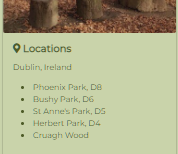

# Shinrin-Yoku

This is a [promotional website](https://kenwals.github.io/shinrin-yoku/) for a forest bathing meetup group, one of its strategies is promote the importance of trees and nature. 

Forest bathing originated in Japan in the 1980s, where it is known as *Shinrin-Yoku*. It is the practice of walking in any natural environment and consciously connecting with what’s around you.

This [site](https://kenwals.github.io/shinrin-yoku/) will hopefully create a community of people who appreciate trees and nature, and maybe wish to learn more about protecting them in their local city. 

---

## Table of contents

1. [**UX**](#ux)
    - [**Scope**](#scope)
    - [**Structure**](#structure)
    - [**Skeleton**](#skeleton)
    - [**Surface**](#surface)
    
2. [**Features**](#features)
    - [**Existing features**](#existing-features)
    - [**Features left to implement**](#features-left-to-implement)

3. [**Technologies Used**](#technologies-used)

4. [**Testing**](#testing)
    - [**Bugs encountered on the way**](#bugs-encountered-on-the-way)
    - [**Known issues**](#known-issues)
    - [**Project barriers and solutions**](#project-barriers-and-solutions)
    - [**Version control**](#version-control)
    - [**Functionality testing**](#functionality-testing)
    - [**CSS3 validator**](#css3-validator)
    - [**HTML5 validator**](#html5-validator)
    - [**Usability testing**](#usability-testing)
    - [**Compatibility testing**](#compatibility-testing)
    - [**Performance testing**](#performance-testing)
    - [**Testing user stories**](#testing-user-stories)

5. [**Deployment**](#deployment)

6. [**Credits**](#credits)
    - [**Content**](#content)
    - [**Resources**](#resources)
    - [**Media**](#media)
    - [**Acknowledgements**](#acknowledgements)

---

## UX

### Scope

This is a fictional meetup group, so there are no limitations on the content. The site will be made to an MVP first, and if there is additional time, content/features can be added.

**User stories**

1. As a visitor to the site, I want to read about forest bathing and its benefits, so that I can decide if I wish to take part.
2. As a visitor to the site, I want to register my details, so I can be added to an email list to receive updates.
3. As a visitor to the site, I want to view nice pictures of nature.
4. As a visitor to the site, I want to read about locations of future forest bathing events.
5. As the site owner, I want to promote my service and have participants for meetups.
6. As the site owner, I want to promote the benefits of Trees and nature in our environment. 

### Structure

Site is put together using HTML, the Bootstrap framework and CSS.

A Mobile first approach is taken - site is all on one page site with three sections, navigation menu at the top. 

Navigation between sections can be done via the navbar or by"call to action" buttons.

### Skeleton

Section 1 - Home page - Navbar at top. Hero image below. With brief headline paragraph. under that a mid-section with introduction paragraph.

Section 2 - About page -  Here is displayed various panels of either Text or images promoting forest bathing, in a gallery format.

Section 3 - Contact page - Email subscribe form, contact information and links to various social media channels in footer section.

**Wireframe**

Below is the initial wireframe.

### Surface

**Colours**

The site theme is about connecting with nature, so the colours too are connected to nature. Various shades of green or natural colours are used. Point of reference for the colours chosen are taken from the site images using a colour palette tool. 

Root variables are used so colours can be updated quickly if revisions are needed. 

Colours used are:

- "Woodland" Green  (#4e5c28) : Used for headings and text when on light background. This colour is used as background on footer. 
- "Green Mist"  (#c9d3aa) : Used on the background of the body and navbar.
- "Nador" Green  (#4F5C54) :  Used on the background of the mid section between hero image and about section.
- "Lemon Grass"  (#9da19a) : Used for text shadow on the hero image text, and box shadow on cards.
- White  (#FFFFFF) : used for text when on a dark background.
- WhiteSmoke  (#F5F5F5) : used for the footer icons.

As colours are configured using rbga() properties, these can be tweaked with opacity values to give more variety to the palette while keeping the uniformity. 

**Icons** used are from fontawesome.com. These icons are visible on buttons, the sub heading of each card in the card gallery and as the social media icons in the footer.

**Images** used are ones I took myself. The original high quality images are located [here](https://photos.google.com/share/AF1QipNpAlgEAwPS5Pjltq_81afFH2kgaHUYhmgoE-poGQhNGkx4mknGbwwCHOTYylgYRw?key=bEFOWWloNGJ6REdpbEZDRzVjd3BROWREaEprTXF3). Images are in jpg format and have been compressed. 

**Fonts** : 

- **"Shadows Into Light"** was used for Header (h1,h2 and h3) text elements
- **"Montserrat"**​ was used for all other text. 

On slow connections, another font may be visible while the site is loading.

##### back to [contents](#table-of-contents)

---

## Features

The site is laid out on one page that has several sections.

### Existing Features

- It is responsive to screen size thanks to bootstrap.

- The navbar at the top collapses into a hamburger button on smaller screens.

- One of the image cards in the gallery is hidden on small screens to improve flow of the page.

- There is form validation on subscription form, an alert displays if name or email fields are empty. 

- In the first two sections a call to action button prompts the user to another section. 

- Hover animations are used on the cards (box shadow appears) in the about section and the social media icons (grow in size) in the footer section.

- Contrasting colours and aria labels are used to ensure site supports visually impaired visitors. 

- The navbar menu is fixed to the top of the screen.

- Some images of trees can be clicked on and the user will be brought to [another site](https://www.curio-eco.com/world/tagged-trees/2538832?lat=53.34427142201096&lng=-6.316257453758462&zml=18) that pinpoints the exact location of the tree.
  
### Features Left to Implement

- Have the subscription form add the visitor to an email list database. 

 ##### back to [contents](#table-of-contents)

---
## Technologies Used

- Languages : HTML, CSS and Bootstrap framework (Navbar uses JavaScript).

- IDE: [Gitpod](https://www.gitpod.io/) (very similar to Visual Studio code but online).

- Version control: Git on [Gitpod](https://www.gitpod.io/) and [Github](https://github.com/).

- Wireframe: [Balsamiq](https://balsamiq.com/)

- Browser Developer tools : [Google Chrome](https://www.google.com/chrome) and [Firefox Developer Edition](https://www.mozilla.org/en-US/firefox/developer/) (which really helped with fonts, accessibility and images).

- Kanban planner : [Github projects](https://github.com/kenwals/shinrin-yoku/projects/1). 

- Markdown editor: [Typora](https://typora.io/) was used when doing bulk updates to my README.md file, Gitpod editor was used for minor updates.

- Image editing: [Adobe online resize tool](https://www.adobe.com/ie/photoshop/online/resize-image.html) and [tinypng](https://tinypng.com/) compression tool.

- Fonts : [Google Fonts](https://fonts.google.com/)

- Icons : [Fontawesome](https://fontawesome.com/)

- Colours palette : [Canva](https://www.canva.com/colors/color-palette-generator/) was used for automatically selecting green colours from images.

- Colour tool : [Google Material Design Color Tool](https://material.io/resources/color/#!/?view.left=0&view.right=1&secondary.color=9db769&primary.color=4e5c28&secondary.text.color=000000&primary.text.color=ffffff) was used when trying to decide what colour to use against which background.

- File renaming utility : PowerRename from [PowerToys on Windows 10](https://www.windowscentral.com/how-bulk-rename-your-files-windows-10-powertoys)

- Pomodoro timer : [Tomato Clock](https://chrome.google.com/webstore/detail/tomato-clock/enemipdanmallpjakiehedcgjmibjihj) 

- Overflow rescue tool : [Unicorn Revealer](https://chrome.google.com/webstore/detail/unicorn-revealer/lmlkphhdlngaicolpmaakfmhplagoaln) was used for when a scroll left to right appeared on my site on smaller screens.

- HEX to RGB converter : [RapidTables](https://www.rapidtables.com/convert/color/hex-to-rgb.html) and [webfx](https://www.webfx.com/web-design/hex-to-rgb/)

- Colour contrast checking for Accessibility refinements : [WebAIM](https://webaim.org/resources/contrastchecker/) was used for when trying to decide what colours to use for text against which background colour.

- Favicon creator : [favicon.io](https://favicon.io/favicon-generator/)

- Autoprefixer CSS : [Autoprefixer](https://autoprefixer.github.io/)

- Beautifier for HTML and CSS : [dirtyMarkUp](https://www.10bestdesign.com/dirtymarkup/)

- Image conversion tool to WEBP (Next gen image format) : [XnConvert](https://www.xnview.com/en/xnconvert/)

##### back to [contents](#table-of-contents)  

---
## Testing

I tested the site as I went along, manual testing or automated testing using online tools (listed below). I focused on getting the site working on a small mobile phone screen first (iPhone 5 simulation on the Chrome Developer tools), and then subsequently all other screen sizes.

Utilities/channels used for testing were:

- [lighthouse](https://developers.google.com/web/tools/lighthouse) report in Chrome devtools and on command line.

- [w3c HTML Markup Validation service](https://validator.w3.org/nu/?doc=https%3A%2F%2Fkenwals.github.io%2Fshinrin-yoku%2F)

- [w3c CSS Validation Service](https://jigsaw.w3.org/css-validator/#validate_by_input)

- [WebAIM](https://webaim.org/resources/contrastchecker/) was used for when trying to decide what colours to use for text against which background colour.

- http://ami.responsivedesign.is/

- [Accessibility](https://accessibilityinsights.io/) insight for the web (microsoft)

- [Accessibility insprector](https://developer.mozilla.org/en-US/docs/Tools/Accessibility_inspector) on Firefox Developer Edition.

- Peer review channel on slack

- Simulated Devices on Developer tools in Chrome and sometimes on Firefox Developer Edition.

- Friends and family.

- Personally checking every smart device I had within reach.

### Bugs encountered on the way

1. Navbar was not expanding collapsing correctly. its turns out i choose the wrong emmet shortcut command when starting the site. So the incorrect version of bootstrap and JavaScript was chosen. Once I replaced both the navbar worked correctly.
3. Git commit issue, in the beginning i was using only git on the command line. Somehow not all my commits were appearing in GitHub when i pushed them. The problem maybe linked to me using Gitpod in more then one browser (chrome and Firefox) while i was trying to debug something else. I resolved this issue by git committing with the Gitpod UI instead.
4. Page title was too long for mobile phone viewing, it was causing the hamburger button onto a new line. Fix was made by adding a media query to allow the h1 title font size reduced for smaller screens.
4. CSS comments, i made a mistake with the format used initially for commenting in the CSS file. I was using the JavaScript format (//)for commenting, this resulted in a problem with the colours not displaying correctly for a while in the infant version of the site.
5. Images missing on GitHub pages even though they worked in Gitpod environment. fix for this was to input a "." in the beginning of image file address.

### Known issues

1. On medium and larger screens the navbar items flicker after they have been selected.
2. When tested on Internet Explorer and my smart tv browser(outdated version of WebOS NetCast), the background colours don't show for hero text, mid section text and footer section.
3. The [Curio](https://www.curio-eco.com/) website that some images links to is very slow to load. 

### Project barriers and solutions

#### The navbar 

It was desirable to have the navbar menu float at the top of the screen, but I had difficulty getting the menu to collapse itself automatically with the standard Bootstrap template. But I seen [this solution](https://stackoverflow.com/questions/36405991/bootstrap-toggle-menu-on-one-page-site-does-not-uncollapse-when-clicked/36406437#36406437) mentioned on Slack, so I included this trick in the navbar links list of classes. 

#### Gitpod

Gitpod has been an enemy of mine on some occasions, I have lost work a few times with it. I may have to use another IDE option on future projects. 

#### Images format dilema 

In the lighthouse performance audit report, the images are sometimes flagged as being an opportunity to be better served as next-gen formats such as JPEG 2000, or WebP. I tried converting the images to JPEG 2000, but noticed the images got bigger so i abandoned that opportunity. I then converted images to WebP, this did give reduced file size. When testing the performance, I could see gains on mobile browser, but i think the site felt slower on desktop. Also the images failed to load on Safari Browser(a friend checked this for me!). So i decided to abandon it, perhaps in a later version of the site i can have the images dynamic to the browser/device.  

#### Colour scheme compromise and font challenges

The font and colour scheme chosen for this site initially had problems with the accessibility audits (Firefox, Lighthouse and Accessibility insights). So I had to make a slight change to the colour scheme in order to have the ideal colour contrasts to ensure legibility of content.

### Version control

For version control I used the UI on Gitpod for making commits, and command line for branches, Merging was done on the GitHub site. I used branches when I was working on new features, some branch's were scrapped  and didn't make it to the master.

### Functionality Testing

Navbar: all the links work, this section is responsive to screen size, menu collapses after item is selected.

Hero image and text: clearly visible/readable, call to action button takes user to the about section.

About section: The card gallery is a template taken from the bootstrap framework library. It is responsive to screen size off the shelf. Some images have links that take you to another site. No issues found. 

Email link on contact page: This behaves as expected, the link should trigger the users browser to open a new window for composing an email, the To field and the subject field should be prepopulated.

Subscription form : The form displays validation messages if fields are blank when the subscribe button is pressed. 

Footer section : All icons animate when the mouse is hovering over them, each icon links to a new page.

Devices manually tested browser for the following devices on:  

- Android Mobile phone  (Screen width 320px)        Samsung Galaxy SIII mini
- Android Mobile phone  (Screen width 360px)        Oneplus One
- Android Mobile phone  (Screen width 412px)        Oneplus Six 
- Android Tablet   (Screen width 600px) sm              Google NEXUS 7
- Smart TV WEBOS  (Screen width 1920px) lg           LG 
- Windows 10 laptop  (Screen width 2560px)            Dell XPS
  

### CSS3 validator 

A known problem with jigsaw is that it does not recognise root variables and rgba() combinations. [source](https://stackoverflow.com/questions/57661659/w3c-css-validation-parse-error-on-variables). Also there is warnings for vendor prefixes (added by the Autoprefixer), but i believe from comments on Slack can safely be ignored. Apart from these limitations with jigsaw, there is no validation issues. 

### HTML5 validator

Initially I did have typos and invalid syntax, all issues resolved.  No validation errors to report now.

### Usability Testing

I shared the project on the peer review channel and also with friends/family. No major usability issues were raised.

The Validation reports [Lighthouse](https://developers.google.com/web/tools/lighthouse) Accessibility and [Microsofts Accessibility Insights](https://accessibilityinsights.io/) gave me interesting insights on issues that would impact visually impaired visitors to the site, as a result I made efforts to improve access for this audience. 

### Compatibility Testing

| Screen size\Browser                          | Chrome | Firefox | Edge |
| -------------------------------------------- | ------ | ------- | ---- |
| Android Mobile phone (Screen width 320px) xs | Pass | Pass | Pass |
| Android Mobile phone (Screen width 412px) xs | Pass | Pass | Pass |
| Android Tablet (Screen width 600px) sm       | Pass | Pass | Pass |
| Windows laptop (Screen width 2560px)         |   pass |  pass |  pass    |

### Performance Testing

Lighthouse Performance report highlighted issues for me in regard to Performance. I made improvements to the page based on this feedback such as compressing the images, using lazy loading on images that weren't visible on initial loading.

### Testing User Stories

1. As a visitor to the site, I want to read about forest bathing and it's benefits, so that I can decide if I wish to take part.

    

*There is bit size pieces of information spread around the home page section and the about page section.*

2. As a visitor to the site, I want to register my details, so I can be added to an email list to receive updates.

    

*This can be achieved on the contact page section.* There is a sign up button that links to this section on the home page. 

3. As a visitor to the site, I want to view nice pictures of nature.

    

*Various pictures are used on each section of the site.*

4. As a visitor to the site, I want to read about locations of future forest bathing events.

    

*A list of locations is available on the second card in the about page section.*

5. As the site owner, I want to promote my service and have participants for meetups.

    

*The site is structured to load up fast to avoid bounce from visitors, it also prompts the user to sign up their contact details if they wish the hear more.*

6. As the site owner, I want to promote the benefits of Trees and nature in our environment. 

    

*Various facts about trees and nature are displayed in the about page section.* 

##### back to [contents](#table-of-contents)

---
## Deployment

For easy deployment on GitHub pages you will need a GitHub user account and a possibly a Gitpod user account. If you wish to make changes to this repository, please follow the GitHub steps first. 

**GitHub**

GitHub is a code hosting platform for version control and collaboration. It's free to enrol for a user account and I would recommend you have one if you wish to deploy this repository and make changes.

When you have a GitHub account you can simple click on the Fork button on the top right corner. This is clone the Shinrin-Yuko repository for your GitHub account, then you can make any changes you like.

**Gitpod**

The site can edited easily on a Gitpod online workspace, you first register a free user account on http://gitpod.io/, then download the Gitpod extension on your preferred internet browser. On signing up you will be expected to  have a GitHub user account.

Once you have the extension on your browser, a green Gitpod button will appear beside this repository in GitHub. For best results fork the repository in your personal account before you open it in Gitpod.

**GitHub Pages**

Once you have the completed site in your own repository, you can deploy to GitHub pages by the following steps.

1. On GitHub, go to the completed sites repository.
2. Click on settings, on the settings page scroll down the the GitHub Pages section. 
3. Under GitHub pages, Select the appropriate branch or folder the index.html is in. 
4. Click on save. A message should then appear advising the URL of your deployed site.

**Cloning**

If you prefer working on the repository locally, you can clone the repository to your desktop by the following steps.

1. Go to [the Shinrin-Yuko github page](https://github.com/kenwals/shinrin-yoku).
2. Above the list of files, click on the code button.
3. - To clone the repository using HTTPS, under "Clone with HTTPS", click the paste icon. 
   - To clone the repository using an SSH key, click Use SSH, then click the paste icon. 
   - To clone a repository using GitHub CLI, click Use GitHub CLI, then click the paste icon.
4. Open Git Bash.
5. Change the current working directory to the location where you want the cloned directory.
5. Type 'git clone', then paste the URL you copied earlier above. 
6. Press Enter to create your local clone.

##### back to [contents](#table-of-contents)  

---
## Credits

### Content

- [Nature therapy ireland](https://www.instagram.com/naturetherapyireland) 
- [Shinrin Yuko Finland](https://www.shinrin-yoku.fi/home-en)
- [Forest Therapy Society,Japan](https://fo-society.jp/therapy/cn45/e_en.html)
- [Dublin City Council Tree strategy](https://www.dublincity.ie/sites/default/files/media/file-uploads/2018-08/Dublin_City_Tree_Strategy_2016-2020.pdf)

### Resources

- [Bootstrap components](https://getbootstrap.com/)
- [W3schools](https://www.w3schools.com/)
- [Code institute's Slack workspace channels](https://slack.com)
- How to make a Kick-Ass first Milestone (part 1, 2 and 3)
- [CSS tricks](https://css-tricks.com/) 
- [YouTube](https://www.youtube.com/)
- [Stack Exchange](https://stackexchange.com/)
- [Hover.css](https://ianlunn.github.io/Hover/#effects)
- [MDN Web Docs](https://developer.mozilla.org/en-US/)

### Media

- The photos used in this site were taken by me mostly in Dublin, Ireland. [Album available here](https://photos.google.com/share/AF1QipNpAlgEAwPS5Pjltq_81afFH2kgaHUYhmgoE-poGQhNGkx4mknGbwwCHOTYylgYRw?key=bEFOWWloNGJ6REdpbEZDRzVjd3BROWREaEprTXF3).

### Acknowledgements

- [This newspaper article from The Irish Times](https://www.irishtimes.com/news/environment/busconnects-final-plans-for-16-dublin-bus-corridors-published-1.4400026 "Irish Times newspaper"). On the back this news article, I was inspired to make a site that could promote the importance of Trees and why they should be cherished and valued more then wider roads in our cities.

- The book ["The Hidden Life of Trees"](https://www.goodreads.com/book/show/28256439-the-hidden-life-of-trees) by Peter Wohlleben.

- Various people at [code institute](https://codeinstitute.net/) and the code institute Slack channel.

- [Imbibe](https://imbibe.ie/) Coffee Roasters and [Barry's Tea](https://www.barrystea.ie/).

 ##### back to [contents](#table-of-contents)   