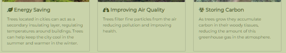

# Testing

## Table of contents
- [**Performance testing**](#performance-testing)
- [**Bugs encountered on the way**](#bugs-encountered-on-the-way)
- [**Known issues**](#known-issues)
- [**Project barriers and solutions**](#project-barriers-and-solutions)
- [**Version control**](#version-control)
- [**Functionality testing**](#functionality-testing)
- [**CSS3 validator**](#css3-validator)
- [**HTML5 validator**](#html5-validator)
- [**Usability testing**](#usability-testing)
- [**Compatibility testing**](#compatibility-testing)
- [**Testing user stories**](#testing-user-stories)

---

I tested the site as I went along, manually testing or automated testing using online tools (listed below). I focused on getting the site working on a small mobile phone screen first (iPhone 5 simulation on the Chrome Developer tools), and then subsequently all other screen sizes.

Utilities/channels used for testing were:

- [lighthouse](https://developers.google.com/web/tools/lighthouse) report in Chrome devtools and on command line.

- [w3c HTML Markup Validation service](https://validator.w3.org/nu/?doc=https%3A%2F%2Fkenwals.github.io%2Fshinrin-yoku%2F)

- [w3c CSS Validation Service](https://jigsaw.w3.org/css-validator/#validate_by_input)

- [WebAIM](https://webaim.org/resources/contrastchecker/) was used for when trying to decide what colours to use for text against which background colour.

- http://ami.responsivedesign.is/

- [Accessibility](https://accessibilityinsights.io/) insight for the web (microsoft)

- [Accessibility inspector](https://developer.mozilla.org/en-US/docs/Tools/Accessibility_inspector) on Firefox Developer Edition.

- Peer review channel on slack

- Simulated Devices on Developer tools in Chrome and sometimes on Firefox Developer Edition.

- Friends and family.

- Personally checking every smart device I had within reach.

- [responsinator.com](http://www.responsinator.com/?url=https%3A%2F%2Fkenwals.github.io%2Fshinrin-yoku%2F)

## Performance Testing

Lighthouse Performance report highlighted issues for me in regard to Performance. I made improvements to the page based on this feedback such as compressing the images, using lazy loading on images that weren't visible on initial loading.

## Bugs encountered on the way

1. Navbar was not expanding or collapsing correctly. it turned out i choose the wrong emmet shortcut command when starting the site. So the incorrect version of bootstrap and JavaScript was chosen. Once I replaced both the navbar worked correctly.
2. Git commit issue, in the beginning i was using only using git on the command line. Somehow not all my commits were appearing in GitHub when i pushed them. The problem maybe linked to me using Gitpod in more then one browser (Chrome and Firefox) while i was trying to debug something else. I resolved this issue by git committing with the Gitpod UI instead.
3. Page title was too long for mobile phone viewing, it was pushing the hamburger button onto a new line. Fix was made by adding a media query to allow the h1 title font size reduced for smaller screens.
4. CSS comments, i made a mistake with the format used initially for commenting in the CSS file. I was using the JavaScript format (//)for commenting, this resulted in a problem with the colours not displaying correctly for a while in the infant version of the site.
5. Images missing on GitHub pages even though they worked in Gitpod environment. fix for this was to input a "." in the beginning of image file address.

## Known issues

1. On medium and larger screens the navbar items flicker after they have been selected.
2. When tested on Internet Explorer and my smart tv browser(outdated version of WebOS NetCast), the background colours don't show for hero text, mid section text and footer section.
3. The [Curio](https://www.curio-eco.com/) website that some images links to is very slow to load. 

## Project barriers and solutions

### The navbar 

It was desirable to have the navbar menu float at the top of the screen, but I had difficulty getting the menu to collapse itself automatically with the standard Bootstrap template. But I seen [this solution](https://stackoverflow.com/questions/36405991/bootstrap-toggle-menu-on-one-page-site-does-not-uncollapse-when-clicked/36406437#36406437) mentioned on Slack, so I included this trick in the navbar links list of classes. 

### Gitpod

Gitpod has been an enemy of mine on some occasions, I have lost work a few times with it. I may have to use another IDE option on future projects. 

### Images format dilemma 

In the lighthouse performance audit report, the images are sometimes flagged as being an opportunity to be better served as next-gen formats such as JPEG 2000, or WebP. I tried converting the images to JPEG 2000, but noticed the images got bigger so I abandoned that opportunity. I then converted images to WebP, this did give reduced file size. When testing the performance, I could see gains on mobile browser, but i think the site felt slower on desktop. Also the images failed to load on Safari Browser(a friend checked this for me!). So I decided to abandon it, perhaps in a later version of the site i can have the images dynamic to the browser/device.  

### Colour scheme compromise and font challenges

The font and colour scheme chosen for this site initially had problems with the accessibility audits (Firefox, Lighthouse and Accessibility insights). So I had to make a slight change to the colour scheme in order to have the ideal colour contrasts to ensure legibility of content.

## Version control

For version control I used the UI on Gitpod for making commits, and command line for branches, Merging was done on the GitHub site. I used branches when I was working on new features, some branch's were scrapped  and didn't make it to the master.

## Functionality Testing

Navbar: all the links work, this section is responsive to screen size, menu collapses after item is selected.

Hero image and text: clearly visible/readable, call to action button takes user to the about section.

About section: The card gallery is a template taken from the bootstrap framework library. It is responsive to screen size off the shelf. Some images have links that take you to another site. No issues found. 

Email link on contact page: This behaves as expected, the link should trigger the users browser to open a new window for composing an email, the To field and the subject field are then prepopulated for the user.

Subscription form : The form displays validation messages if fields are left blank when the subscribe button is pressed. 

Footer section : All icons animate when the mouse is hovering over them, each icon links to a new page.

Devices manually tested browser for the following devices on:  

- Android Mobile phone  (Screen width 320px) xs       Samsung Galaxy SIII mini
- Android Mobile phone  (Screen width 360px) xs       Oneplus One
- Android Mobile phone  (Screen width 412px) xs       Oneplus Six 
- Android Tablet   (Screen width 600px) sm              Google NEXUS 7
- Smart TV WEBOS  (Screen width 1920px) lg           LG 
- Windows 10 laptop  (Screen width 2560px)            Dell XPS
  

## CSS3 validator 

A known problem with jigsaw is that it does not recognise root variables and rgba() combinations. [source](https://stackoverflow.com/questions/57661659/w3c-css-validation-parse-error-on-variables). Also there is warnings for vendor extension prefixes (added by the Autoprefixer), but i believe (from discussions on Slack) these can safely be ignored. Apart from these limitations with jigsaw, there is no validation issues. 

## HTML5 validator

No validation errors to report.

## Usability Testing

I shared the project on the peer-review channel on slack, and also with friends/family. No major usability issues were raised. I did receive feedback on Footer background colour, Footer icon centering and navigation items offset. These snags were all rectified after they were raised. 

The Validation reports [Lighthouse](https://developers.google.com/web/tools/lighthouse) Accessibility and [Microsofts Accessibility Insights](https://accessibilityinsights.io/) gave me interesting insights on issues that would impact visually impaired visitors to the site, as a result I made efforts to improve access for this audience. 

## Compatibility Testing

| Screen size\Browser                          | Chrome | Firefox | Edge |
| -------------------------------------------- | ------ | ------- | ---- |
| Android Mobile phone (Screen width 320px) xs | Pass | NA | NA |
| Android Mobile phone (Screen width 412px) xs | Pass | Pass | Pass |
| Android Tablet (Screen width 600px) sm       | Pass | Pass | Pass |
| Windows laptop (Screen width 2560px)         |   Pass |  Pass |  Pass    |

## Testing User Stories

### Visitor goals

1. As a visitor to the site, I want to read about forest bathing and it's benefits, so that I can decide if I wish to take part.

    

*There is bite size pieces of information spread around the home page section and the about page section.*

2. As a visitor to the site, I want to register my details, so I can be added to an email list to receive updates.

    

*This can be achieved on the contact page section.There is a sign up button that links to this subscription form section on the home page.*

3. As a visitor to the site, I want to view nice pictures of nature.

    

*Various pictures are used on each section of the site.*

4. As a visitor to the site, I want to read about locations of future forest bathing events.

    

*A list of locations is available on the second card in the about page section.*

### Owner goals

5. As the site owner, I want to promote my service and have participants for meetups.

    

*The site is structured to load up fast to avoid bounce from visitors, it also prompts the user to sign up their contact details if they wish the hear more.*

6. As the site owner, I want to promote the benefits of Trees and nature in our environment. 

    

*Various facts about trees and nature are displayed in the about page section.* 

##### back to [contents](#table-of-contents)